# GIU Food Truck Reservation System

## 1. Project Title and Description

**GIU Food Truck Reservation System** is a web-based application that connects customers with food trucks, allowing customers to browse menus, place orders, and schedule pickups, while enabling truck owners to manage their menus and track orders.

### Team Members

| Name | ID | Tutorial |
|------|-----|----------|
| Youssef Ibrahim | 13004378 | T21 |
| Mahmoud Momen | 13005416 | T21 |
| Ahmed Sameh | 13005913 | T21 |
| Omar Tarek | 13004881 | T21 |
| Adham Eletreby | 13001491 | T20 |
| Abdullah Khaled | 13004750 | T19 |
| Youssef Gomaa | 13005157 | T19 |
| Ahmed Mostafa Nassef | 13004273 | T8 |

---

## 2. Features

### Customer Features

- **User Authentication**
  - User registration with name, email, password, and birth date
  - Secure login with session management
  - Logout functionality

- **Browse Food Trucks**
  - View all available food trucks
  - See truck information including name, logo, and status
  - Navigate to truck menus

- **Menu Browsing**
  - View menu items for selected truck
  - Filter menu items by category
  - See item details: name, description, price, category

- **Shopping Cart**
  - Add items to cart with quantity selection
  - View cart items with prices and quantities
  - Modify item quantities (increase/decrease)
  - Remove items from cart
  - View cart total
  - Schedule pickup time

- **Order Management**
  - Place orders with scheduled pickup time
  - View order history (most recent first)
  - View detailed order information including items
  - Track order status with color-coded badges
  - Order statuses: Pending, Preparing, Ready, Completed, Cancelled

- **Dashboard**
  - Welcome page with user name
  - Quick action buttons for navigation
  - "How it works" guide

### Truck Owner Features

- **Owner Dashboard**
  - View truck information and status
  - Toggle order availability (available/unavailable)
  - View statistics: total menu items, pending orders, completed orders
  - Quick access to menu management and orders
  - Recent orders summary (last 5 orders)

- **Menu Management**
  - View all menu items in a table
  - Add new menu items (name, category, description, price)
  - Edit existing menu items
  - View menu item details
  - Delete menu items (sets status to unavailable)
  - Filter and manage menu items by status

- **Order Management**
  - View all orders for the truck
  - Filter orders by status (All, Pending, Preparing, Ready, Completed, Cancelled)
  - View detailed order information with customer details
  - Update order status
  - Set estimated earliest pickup time
  - Color-coded status badges for easy identification

---

## 3. Technology Stack

### Frontend
- **Hogan.js (hjs)** - Template engine for server-side rendering
- **jQuery** - JavaScript library for DOM manipulation and AJAX requests
- **Bootstrap 3** - CSS framework for responsive design
- **Custom CSS** - Styling with color palette (#FAF6F0, #F4EAE0, #F4DFC8, #000000)

### Backend
- **Node.js** - JavaScript runtime environment
- **Express.js** - Web application framework
- **Knex.js** - SQL query builder for database operations
- **UUID** - Unique identifier generation for sessions
- **Body Parser** - Middleware for parsing request bodies

### Database
- **PostgreSQL** - Relational database management system
- **pg** - PostgreSQL client for Node.js

### Development Tools
- **Nodemon** - Development server with auto-restart
- **dotenv** - Environment variable management

---

## 4. ERD (Entity-Relationship Diagram)

The database schema consists of 7 main tables:

### Database Tables

1. **Users**
   - Primary Key: `userId`
   - Attributes: `name`, `email`, `password`, `role`, `birthDate`, `createdAt`
   - Relationships: One-to-many with Trucks (as owner), Orders, Carts, Sessions

2. **Trucks**
   - Primary Key: `truckId`
   - Foreign Key: `ownerId` (references Users)
   - Attributes: `truckName`, `truckLogo`, `truckStatus`, `orderStatus`, `createdAt`
   - Relationships: One-to-many with MenuItems, Orders

3. **MenuItems**
   - Primary Key: `itemId`
   - Foreign Key: `truckId` (references Trucks)
   - Attributes: `name`, `description`, `price`, `category`, `status`, `createdAt`
   - Relationships: One-to-many with Carts, OrderItems

4. **Orders**
   - Primary Key: `orderId`
   - Foreign Keys: `userId` (references Users), `truckId` (references Trucks)
   - Attributes: `orderStatus`, `totalPrice`, `scheduledPickupTime`, `estimatedEarliestPickup`, `createdAt`
   - Relationships: One-to-many with OrderItems

5. **OrderItems**
   - Primary Key: `orderItemId`
   - Foreign Keys: `orderId` (references Orders), `itemId` (references MenuItems)
   - Attributes: `quantity`, `price`

6. **Carts**
   - Primary Key: `cartId`
   - Foreign Keys: `userId` (references Users), `itemId` (references MenuItems)
   - Attributes: `quantity`, `price`

7. **Sessions**
   - Primary Key: `id`
   - Foreign Key: `userId` (references Users)
   - Attributes: `token`, `expiresAt`

### ERD Diagram

The Entity-Relationship Diagram illustrates the database schema with 7 main entities and their relationships:

**Entities:**

1. **Users** (Blue rounded rectangle)
   - Primary Key: `userId`
   - Attributes: `name`, `email`, `password`, `role`, `birthDate`, `createdAt`
   - Relationships: One-to-many with Trucks (as owner), Orders, Carts, Sessions

2. **Trucks** (Brown rounded rectangle)
   - Primary Key: `truckId`
   - Foreign Key: `ownerId` → references `Users.userId`
   - Attributes: `truckName`, `truckLogo`, `truckStatus`, `orderStatus`, `createdAt`
   - Relationships: One-to-many with MenuItems, Orders

3. **MenuItems** (Purple rounded rectangle)
   - Primary Key: `itemId`
   - Foreign Key: `truckId` → references `Trucks.truckId`
   - Attributes: `name`, `description`, `price`, `category`, `status`, `createdAt`
   - Relationships: One-to-many with Carts, OrderItems

4. **Orders** (Dark Green rounded rectangle)
   - Primary Key: `orderId`
   - Foreign Keys: `userId` → references `Users.userId`, `truckId` → references `Trucks.truckId`
   - Attributes: `orderStatus`, `totalPrice`, `scheduledPickupTime`, `estimatedEarliestPickup`, `createdAt`
   - Relationships: One-to-many with OrderItems

5. **OrderItems** (Dark Brown rounded rectangle)
   - Primary Key: `orderItemId`
   - Foreign Keys: `orderId` → references `Orders.orderId`, `itemId` → references `MenuItems.itemId`
   - Attributes: `quantity`, `price`

6. **Carts** (Dark Red rounded rectangle)
   - Primary Key: `cartId`
   - Foreign Keys: `userId` → references `Users.userId`, `itemId` → references `MenuItems.itemId`
   - Attributes: `quantity`, `price`

7. **Sessions** (Dark Blue rounded rectangle)
   - Primary Key: `id`
   - Foreign Key: `userId` → references `Users.userId`
   - Attributes: `token`, `expiresAt`

**Entity Relationships:**
- **Users → Trucks:** One user (truck owner) can own multiple trucks
- **Users → Orders:** One user (customer) can place multiple orders
- **Users → Carts:** One user can have multiple items in their cart
- **Users → Sessions:** One user can have multiple active sessions
- **Trucks → MenuItems:** One truck can offer multiple menu items
- **Trucks → Orders:** One truck can receive multiple orders
- **Orders → OrderItems:** One order can contain multiple order items
- **MenuItems → Carts:** One menu item can be in multiple carts
- **MenuItems → OrderItems:** One menu item can be part of multiple order items

*Note: The visual ERD diagram should be added to the screenshots folder. The diagram shows all relationships with primary keys (PK) and foreign keys (FK) clearly marked using connecting lines.*

---

## 5. Installation and Setup

### Prerequisites

- Node.js (v14 or higher)
- PostgreSQL (v12 or higher)
- pgAdmin4
- Visual Studio Code (recommended)

### Step-by-Step Installation

1. **Install PostgreSQL**
   - Download and install PostgreSQL from the official website
   - Remember the password you set during installation (you'll need it later)

2. **Set up Database**
   - Open pgAdmin4
   - Register a new server:
     - Name: `db_server`
     - Host: `localhost`
     - Port: `5432`
     - Username: `postgres`
     - Password: (the password you set during PostgreSQL installation)
   - Connect to the server
   - Navigate to: `Databases` → `postgres` → `Schemas`
   - Create a new schema named `FoodTruck`
   - Open Query Tool
   - Copy the contents of `connectors/scripts.sql`
   - Paste and execute the SQL script to create all tables

3. **Clone/Download the Project**
   - Download or clone the project repository
   - Open the project folder in Visual Studio Code

4. **Install Node.js Dependencies**
   - Open terminal in Visual Studio Code
   - Run the following command:
     ```bash
     npm install axios express knex pg uuid hjs dotenv
     ```
   - Install development dependencies:
     ```bash
     npm install nodemon --save-dev
     ```

5. **Configure Environment Variables**
   - Create a `.env` file in the root directory (if it doesn't exist)
   - Add the following content:
     ```
     PORT=3001
     PASSWORD=your_postgres_password
     ```
   - Replace `your_postgres_password` with the password you used during PostgreSQL installation

6. **Run the Application**
   - In the terminal, run:
     ```bash
     npm run server
     ```
     Or:
     ```bash
     node server.js
     ```
   - The server will start on `http://localhost:3001`

7. **Access the Application**
   - Open your web browser
   - Navigate to `http://localhost:3001`
   - You should see the login page

### Testing the Backend (Optional)

- Install Thunder Client extension in Visual Studio Code
- Use it to test API endpoints
- Press `Ctrl + C` to stop the server

---

## 6. Test Credentials

### Truck Owner Account
- **Email:** `sara@example.com`
- **Password:** `$2b$10$hashedpassword2`

### Customer Account
- **Email:** `ahmed@example.com`
- **Password:** `$2b$10$hashedpassword1`

*Note: These are test accounts. You may need to create these users in the database if they don't exist.*

---

## 7. Screenshots

### Public Pages

#### Login Page
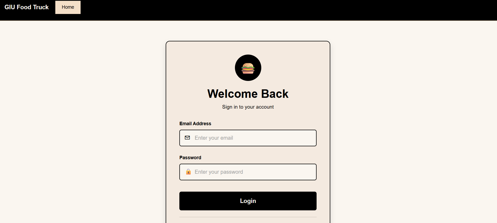
- User authentication with email and password
- Link to registration page
- Error handling for invalid credentials

#### Register Page
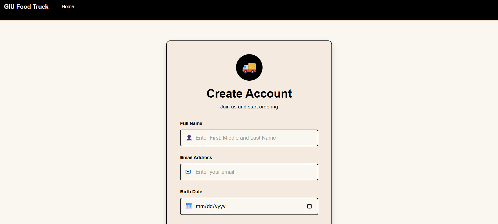
- User registration form
- Fields: Name, Email, Birth Date, Password
- Validation and error handling

### Customer Pages

#### Customer Dashboard
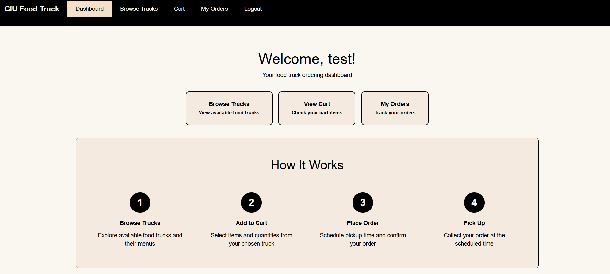
- Welcome message with user name
- Quick action buttons
- "How it works" section

#### Browse Trucks
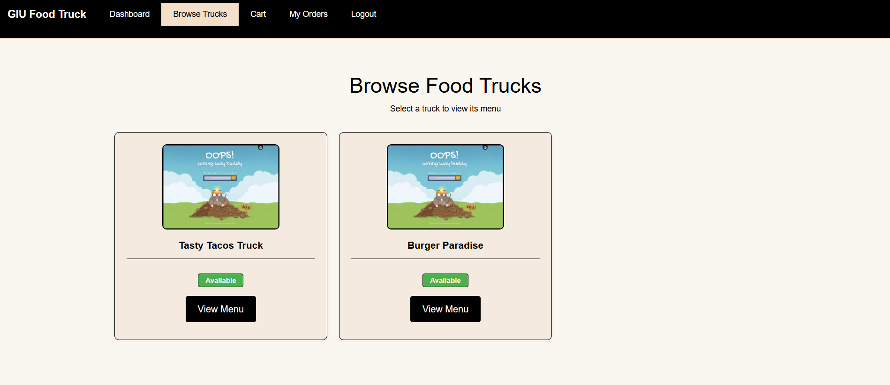
- Grid view of available food trucks
- Truck cards with name, logo, and status
- "View Menu" button for each truck

#### Truck Menu
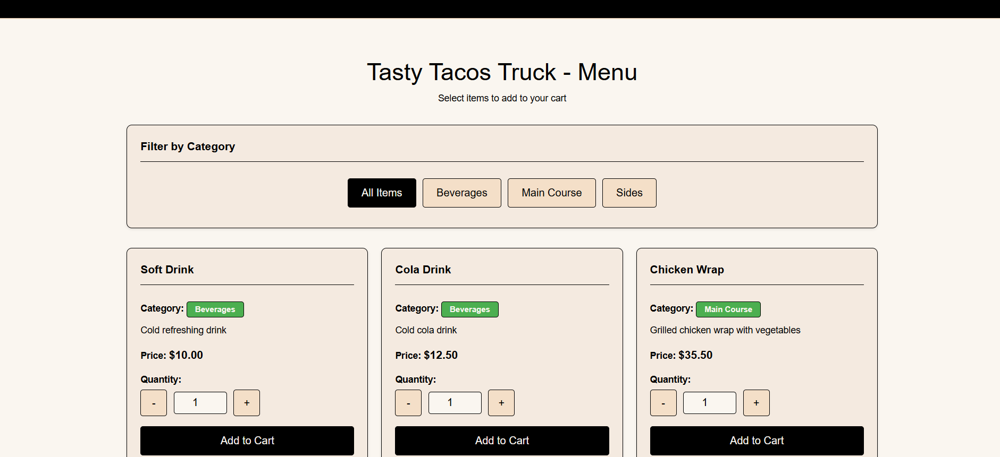
- Menu items displayed in cards
- Category filter buttons
- Quantity selector and "Add to Cart" button

#### Shopping Cart
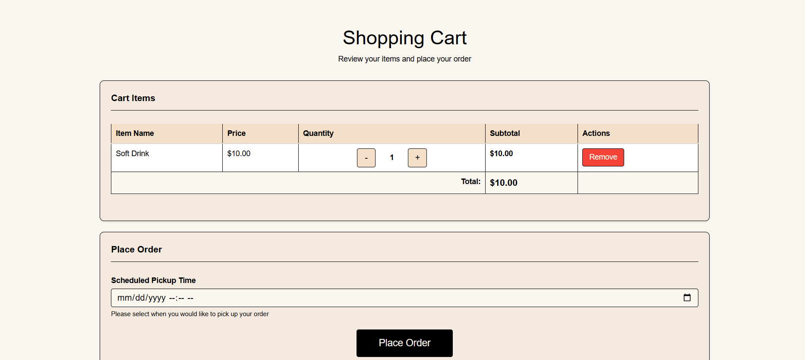
- Cart items in table format
- Quantity modification buttons
- Remove item functionality
- Scheduled pickup time selector
- Place Order button

#### My Orders
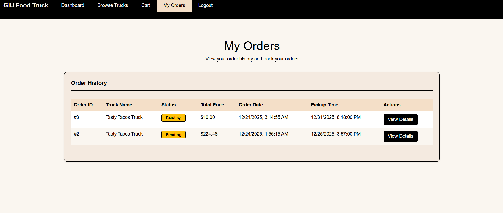
- Order history table
- Color-coded status badges
- View Details button for each order

#### Order Details
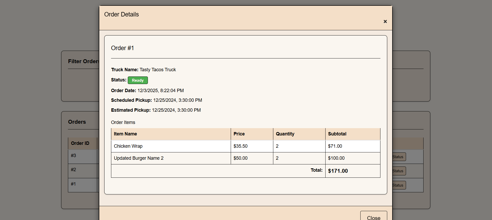
- Full order information
- Items list with quantities and prices
- Order total

### Truck Owner Pages

#### Owner Dashboard
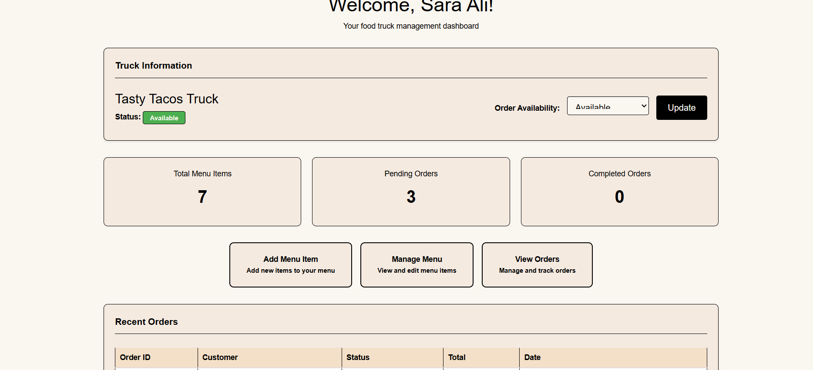
- Truck information and status
- Statistics cards
- Quick action buttons
- Recent orders summary

#### Menu Items Management

- Table of all menu items
- View, Edit, Delete actions
- Add New Item button

#### Add Menu Item
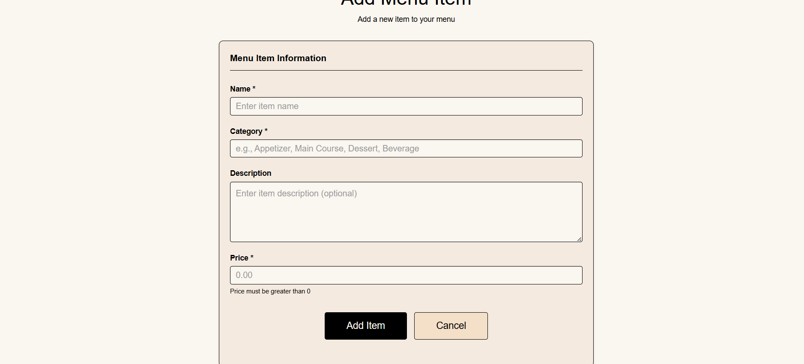
- Form to add new menu items
- Fields: Name, Category, Description, Price
- Validation and error handling

#### Truck Orders
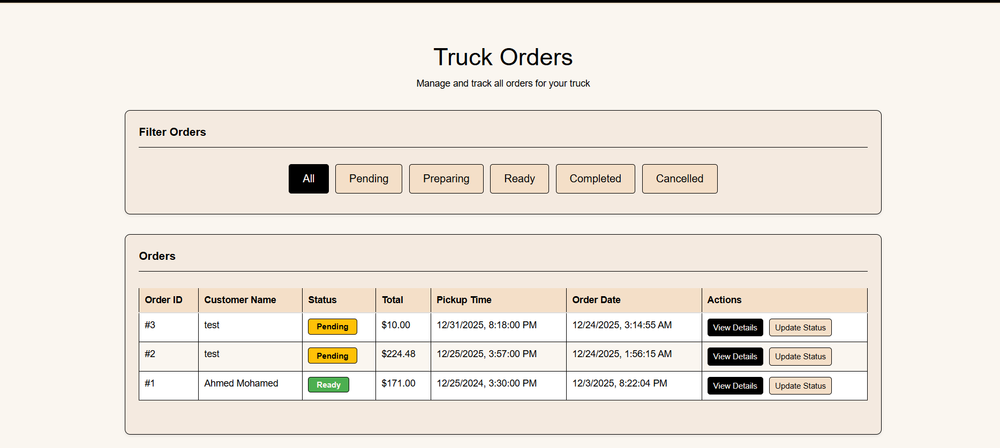
- All orders for the truck
- Filter tabs by status
- Update Status functionality
- View Details for each order

---

## 8. API Endpoints Summary

### Public Endpoints (No Authentication Required)

| Method | Endpoint | Description | Request Body | Response |
|--------|----------|-------------|--------------|----------|
| POST | `/api/v1/user` | Register new user | `{name, email, password, birthDate}` | User object or error |
| POST | `/api/v1/user/login` | User login | `{email, password}` | Success message or error |

### Private Endpoints (Authentication Required)

#### Menu Items (Truck Owner Only)

| Method | Endpoint | Description | Request Body | Response |
|--------|----------|-------------|--------------|----------|
| POST | `/api/v1/menuItem/new` | Create new menu item | `{name, category, description, price, status?}` | Created item or error |
| GET | `/api/v1/menuItem/view` | Get all menu items for owner's truck | - | Array of menu items |
| GET | `/api/v1/menuItem/view/:itemId` | Get single menu item | - | Menu item object or error |
| PUT | `/api/v1/menuItem/edit/:itemId` | Update menu item | `{name?, category?, description?, price?, status?}` | Updated item or error |
| DELETE | `/api/v1/menuItem/delete/:itemId` | Delete menu item (sets status to unavailable) | - | Success message or error |

#### Cart (Customer Only)

| Method | Endpoint | Description | Request Body | Response |
|--------|----------|-------------|--------------|----------|
| POST | `/api/v1/cart/new` | Add item to cart | `{itemId, quantity, price}` | Success message or error |
| GET | `/api/v1/cart/view` | Get all cart items | - | Array of cart items |
| PUT | `/api/v1/cart/edit/:cartId` | Update cart item quantity | `{quantity}` | Updated cart item or error |
| DELETE | `/api/v1/cart/delete/:cartId` | Remove item from cart | - | Success message or error |

#### Trucks

| Method | Endpoint | Description | Request Body | Response |
|--------|----------|-------------|--------------|----------|
| GET | `/api/v1/trucks/view` | Get all available trucks (Customer) | - | Array of trucks |
| GET | `/api/v1/trucks/myTruck` | Get owner's truck info (Truck Owner) | - | Truck object or error |
| PUT | `/api/v1/trucks/updateOrderStatus` | Update truck order availability (Truck Owner) | `{orderStatus}` | Updated truck or error |

#### Menu Items by Truck (Customer Only)

| Method | Endpoint | Description | Request Body | Response |
|--------|----------|-------------|--------------|----------|
| GET | `/api/v1/menuItem/truck/:truckId` | Get all menu items for a truck | - | Array of menu items |
| GET | `/api/v1/menuItem/truck/:truckId/category/:category` | Get menu items by category | - | Array of filtered menu items |

#### Orders

| Method | Endpoint | Description | Request Body | Response |
|--------|----------|-------------|--------------|----------|
| POST | `/api/v1/order/new` | Place new order (Customer) | `{scheduledPickupTime}` | Success message or error |
| GET | `/api/v1/order/myOrders` | Get customer's orders (Customer) | - | Array of orders |
| GET | `/api/v1/order/details/:orderId` | Get order details (Customer) | - | Order details with items |
| GET | `/api/v1/order/truckOrders` | Get all orders for truck (Truck Owner) | - | Array of orders |
| GET | `/api/v1/order/truckOwner/:orderId` | Get order details (Truck Owner) | - | Order details with items |
| PUT | `/api/v1/order/updateStatus/:orderId` | Update order status (Truck Owner) | `{orderStatus, estimatedEarliestPickup?}` | Success message or error |

### Frontend Routes

#### Public Routes
- `GET /` - Login page
- `GET /register` - Registration page

#### Customer Routes (Authentication Required)
- `GET /dashboard` - Customer dashboard
- `GET /trucks` - Browse trucks page
- `GET /truckMenu/:truckId` - Truck menu page
- `GET /cart` - Shopping cart page
- `GET /myOrders` - My orders page

#### Truck Owner Routes (Authentication Required)
- `GET /dashboard` - Owner dashboard (redirects to `/ownerDashboard`)
- `GET /ownerDashboard` - Owner dashboard
- `GET /menuItems` - Menu items management page
- `GET /addMenuItem` - Add menu item page
- `GET /truckOrders` - Truck orders page

---

## 9. Contributors

### Team Member Contributions

| Member | Contribution |
|--------|--------------|
| **Abdullah Khaled** | Updated login & register pages - Created customer dashboard |
| **Mahmoud Momen** | Created Browse Trucks & Truck Menu pages |
| **Ahmed Sameh** | Shopping Cart & Place Order |
| **Youssef Ibrahim (Youssef elgharib)** | My Orders page |
| **Youssef Gomaa (Youssef Hassanein)** | Owner Dashboard |
| **Adham Eletreby** | Menu Items Management |
| **Omar Tarek** | Truck Orders Management (Filtering, Status Updates, Order Details) |
| **Ahmed Mostafa Nassef** | Base styling system, CSS foundation, reusable components, enhanced authentication pages |

## Additional Information

### Project Structure

```
GIU_Food_Truck_Reservation_System/
├── connectors/
│   ├── db.js                 # Database connection configuration
│   ├── scripts.sql           # Database schema SQL script
│   └── seed.sql              # Sample data (optional)
├── middleware/
│   └── auth.js               # Authentication middleware
├── public/
│   ├── images/               # Image assets
│   ├── js/                   # jQuery and Bootstrap libraries
│   ├── src/                  # Frontend JavaScript files
│   │   ├── login.js
│   │   ├── register.js
│   │   ├── trucks.js
│   │   ├── truckMenu.js
│   │   ├── cart.js
│   │   ├── myOrders.js
│   │   ├── ownerDashboard.js
│   │   ├── menuItems.js
│   │   ├── addMenuItem.js
│   │   └── truckOrders.js
│   └── styles/               # CSS files
│       ├── bootstrap.min.css
│       └── style.css
├── routes/
│   ├── private/              # Protected routes
│   │   ├── api.js            # Private API endpoints
│   │   └── view.js            # Private view routes
│   └── public/               # Public routes
│       ├── api.js            # Public API endpoints
│       └── view.js            # Public view routes
├── utils/
│   └── session.js            # Session management utilities
├── views/                     # Hogan.js templates
│   ├── login.hjs
│   ├── register.hjs
│   ├── customerHomepage.hjs
│   ├── trucks.hjs
│   ├── truckMenu.hjs
│   ├── cart.hjs
│   ├── myOrders.hjs
│   ├── ownerDashboard.hjs
│   ├── menuItems.hjs
│   ├── addMenuItem.hjs
│   └── truckOrders.hjs
├── screenshots/               # Application screenshots
├── .env                       # Environment variables
├── package.json               # Node.js dependencies
├── server.js                  # Main server file
└── README.md                  # This file
```

### Color Palette

The application uses a consistent color palette throughout:

- **Background:** `#FAF6F0` - Main page background
- **Surfaces/Cards:** `#F4EAE0` - Card backgrounds, containers
- **Secondary/Highlights:** `#F4DFC8` - Hover states, secondary buttons
- **Text/Borders/Primary:** `#000000` - All text, borders, primary buttons

### Status Color Coding

- **Pending:** Yellow (`#FFC107`)
- **Preparing:** Blue (`#2196F3`)
- **Ready:** Green (`#4CAF50`)
- **Completed:** Green (`#4CAF50`)
- **Cancelled:** Red (`#F44336`)
- **Available:** Green (`#4CAF50`)
- **Unavailable:** Gray (`#9E9E9E`)


